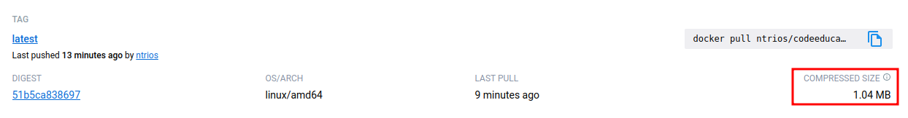
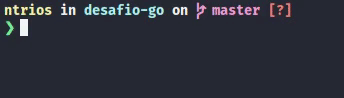

# Desafio Go - Fullcycle

## 1. Proposta
Você terá que publicar uma imagem no docker hub. Quando executarmos:

```
docker run ntrios/codeeducation
```

Temos que ter o seguinte resultado: `Code.education Rocks!`

Lembrando que a Go Lang possui imagens oficiais prontas, vale a pena consultar o Docker Hub.

> ***
> 💡 A imagem do projeto Go precisa ter menos de <span style="color: orange">*2MB*</span>
> ***
&nbsp;
___
&nbsp;
## 2. Resolução
Para esse projeto eu criei o arquivo "`hello.go`" que imprime na tela a sentença solicitada. E um arquivo "`Dockerfile`" usando a imagem `golang:alpine`, para reduzir significativamente o tamanho da imagem, utilizei o Multi Stage com a imagem `scratch`.





Para acessar a imagem no Docker Hub, [clique aqui](https://hub.docker.com/r/ntrios/codeeducation/tags).

Ou rode o comando abaixo para baixar a imagem do projeto.
```
docker pull ntrios/codeeducation:latest
```

